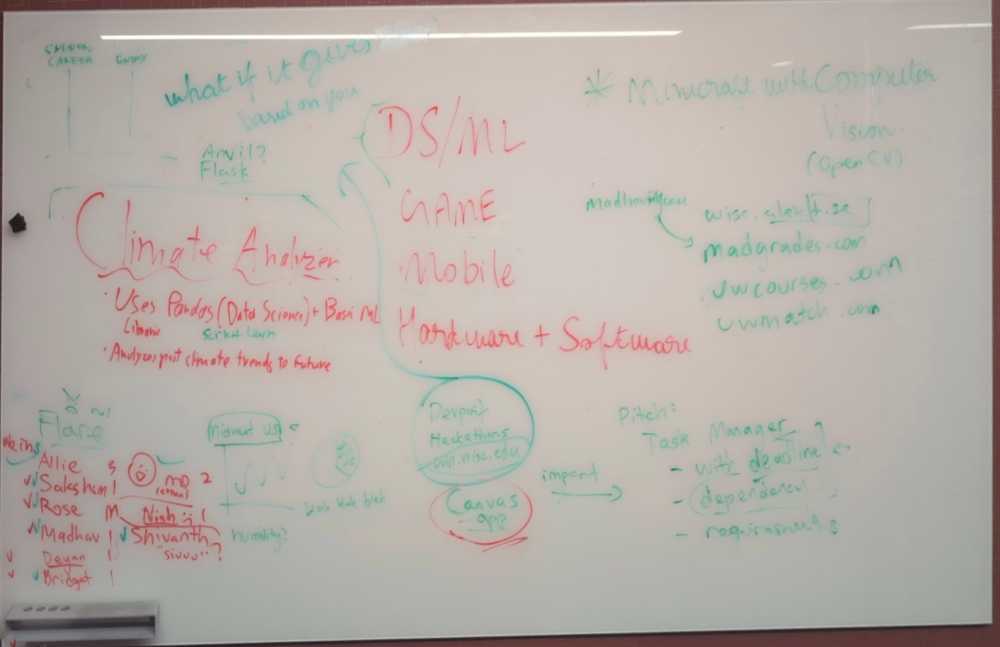

# Ethan's Meeting Memo: Thursday, 2025 October 16

(I think Allie will be posting hers in the Discord server soon?
This will be mine anyways.  I'm putting something down and hopefully
by the end of this weekend we can all have something to look at.
**Edit October 21**: I think everyone will just have to look at
mine then, oh welp... :x)

## Survey and Logistics

The plan is to meet bi-weekly.  And I think Allie will be booking
the room next week as well since she is the leader and has done it
and therefore she is likely the one to do it next time?

The following members are confirmed to be in Team 17 according
to [Allie's finalized roster of the team emailed to the club](https://discord.com/channels/1428212879026552872/1428212880184184854/1430371438048710759):

 - Allie
 - me (ethan :P)
 - Bridget
 - Rose
 - Madhav
 - Saksham (Agent),

For the people who showed up at the meeting: I recall there was one
Master's student in computer science, me as a sophomore/2nd year,
and the leader a junior/3rd year; then the rest are freshmen/1st year.
(Most people are freshmen.)

In terms of programming experience I can't say I recall much... except
hearing a lot of Python and Java; and from the Wednesday club meeting
I think people said they knew React.js.  So for applications I was
thinking we'd go with [Electron](https://www.electronjs.org/), and
for web services we'd go with some JS framework (Vue.js, Nuxt.js, Next.js)
or Svelte over MySQL and possibly a Python API backend.  (I myself don't
understand Django that well and I think the learning curve can be a bit steep.)

The primary means of communication would still be Discord.

## Project Brainstorm

We looked at a few existing projects students at UW had made.

*   [MadHousing.com](https://www.madhousing.com/): Housing info site.
    Made at **SDC Club** Spring 2022 ([source](https://www.madhousing.com/about)).
    Looks like Next.js + Tailwind CSS (judging from the HTML source code),
    hosted on Vercel.
*   [wisc.AlexT.se](http://wisc.alext.se/): Grading distribution site.
    Made by one person ([Alexander Tse](https://www.linkedin.com/in/alex-tse/),
    from which we know the site is built with Python and React.)
    *Maybe* open source but I couldn't find the source code.
    Active to present.
*   [MadGrades.com](https://madgrades.com/):  Yet another grading distribution site.
    [Open source](https://github.com/Madgrades/madgrades.com).  Looks like Next.js
    to me (I can't read code).
*   [UWCourses.com](https://uwcourses.com/): Course-selection website
    made at CheeseHacks Fall 2024, active to present.  Built with
    [SvelteKit](https://svelte.dev/docs/kit/introduction) (among other things
    I definitely don't understand like how they made the graph).
    [Open source](https://github.com/twangodev/uw-coursemap) and AGPL.
*   [UWMatch.com](https://www.uwmatch.com/): made by a few people
    from the end of December 2024 to present.  Build with Svelte backed by
    [FastAPI](https://fastapi.tiangolo.com/) + NoSQL [MongoDB](https://www.mongodb.com/),
    (with an non-negligible amount of help from Cursor), also hosted on Vercel.
    Closed source.  **Has had the desire to expand to a centralized club
    (student org) hub.**

Apparently doing something UW-related is pretty trendy.

Anyways, the final contenders from our meeting were my idea of **To-do list**
and multiple people's idea of what eventually became **club discovery service**.
Here were our pitches:

## Task Manager

(Ethan's pitch) So we're college students, and the amount of homework is
unlike anything most of us have had before.  And although you can see
most of your assignments & activities due for each day on Canvas (you can
even tell Canvas to import those into Google Calendar which is something I
always forget you can do \*facepalm\*), there is --- and I believe ---
still value in taking responsibilities into our own hands: especially when
we have a personal project where there is no roadmap and no partial
project deadlines and check-ups laid out for us.  And well, we could use
Obsidian and Notion, Microsoft Tasks, Google Tasks... or use [TaskWarrior](https://taskwarrior.org/)
like me!  We would be re-inventing an existing solution, but that's fine
--- it would be just as valuable as an experience, and maybe we can add
a creative twist to it....

So what does a task manager need to remember, and how can it help us
manage tasks?

*   A task *description*.  Something actionable and specific, like
    "Write a blog post about XXX" or "Inspect server logs since DATE".
    There should be a way to write a short description (for overview)
    and a long description (for the details, such as project
    **requirements**/specifications, grading rubrics.  (In the case of
    Canvas it is helpful to include a URL to the page for the assignment.))
*   A task **deadline**.  For homework, this has a very literal
    interpretaion: it's the date by which the task must be done.
    And for those of us that are bad at mental math or get overwhelmed
    by too many tasks easily (I am both), a task manager can *compute*
    the relative date of the deadline, such as "due 2d from now" or
    "due 13min from now".
*   Task **dependencies**.  Now, for those of you who are CS students
    (or maybe just a computer nerd), you may know that people have
    invented [build systems](https://en.wikipedia.org/wiki/Build_automation)
    over and over again: [Unix Make](https://en.wikipedia.org/wiki/Make_%28software%29);
    [distutils](https://docs.python.org/3.0/library/distutils.html) and
    [setuptools](https://setuptools.pypa.io/en/latest/) for Python 2/3;
    [Apache Maven](https://maven.apache.org/) and [Gradle](https://gradle.org/)...
    and somewhat recently there is [Ninja](https://ninja-build.org/).
    Anyways, tangent aside, dependency management would be a powerful
    feature (though only for very large projects I'm afraid).  Since
    task dependency forms a directed acyclic graph, our task manager
    would have to understand how to traverse this graph, how to find
    dependents and dependees... something that the task manager must
    learn, of course, is when a dependee is completed, it must mark
    all dependees as ready.
*   Nested tasks, or **sub-tasks**.  I didn't talk about this much
    in the meeting, but this is the more realistic need for a task
    manager.  The relationship contrasts with above (dependencies)
    in that the parent task *comprises* on its children and is
    *immediately* completed when all of its children are completed.
    (Of course, I am talking about the possibility of arbitrarily
    nested, which in and of itself is still an interesting challenge.)
*   Task **weights**.  Put simply, some homework is simply worth more
    points... if you can't do them all, then the task manager should
    maximize the ones you can complete with more benefits --- that's
    Economics 101!  (The measure of utility is purely theoretical and
    beyond the scope of our software :)
